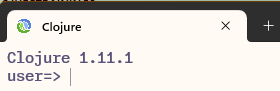

# Why Clojure

Clojure addresses the following pain points with existing languages -

- **Wrong defaults** - existing OO languages are built with wrong defaults e.g. reference equality, mutable collections etc.
- **No interactive mode** (REPL) - so no easy way to experiment various language / library features

## Salient features

- Clojure is a dialect of Lisp (which stands for **Lis**t **P**rocessing). [Racket](https://racket-lang.org/) & [Common Lisp](https://lisp-lang.org/) are some other languages from the Lisp family.
- Clojure is **dynamic** - so it's very suitable for a lot of tasks, such as scripting, data processing etc.
- Even if it is dynamic, it still is a **compiled** language, so it's very fast.
- Runs on **JVM** (or compiles to JVM) supporting existing investments made by customers in Java frameworks and libraries. It also has a port that compiles to JavaScript, called [ClojureScript](https://clojurescript.org/). Then, there is [ClojureDart](https://github.com/Tensegritics/ClojureDart) for Flutter and Dart. Yet another is [libpython-clj](https://github.com/clj-python/libpython-clj) for interacting with Python.
- It has a **REPL** (which stands for **R**ead **E**val **P**rint **L**oop) - which is the interactive mode, just like other dynamic languages have e.g. Python or the modern FP languages have, like [Scala](https://www.scala-lang.org/) & [F#](https://fsharp.org/).
- It has **value equality** (also called structural equality) - meaning, it compares for values (of arrays, maps etc. not their references).
- It has **immutable collections** - which means, once you've initialized an array or a map, it's value cannot be changed. Any change e.g. adding, removing or modifying existing elements leads to new versions of existing collections.
- It is an **FP language** - meaning, you don't need to write classes, just write functions. You can pass a function to other functions, you can return a function from another function and you can store a function in a variable etc.
- FP languages are **expression oriented** i.e. various constructs return a value e.g. if-else is an expression, for loop is an expression (whereas in OO languages like Java or C#, if-else is a statement). *Scala / F# are typed FP languages*.
- Clojure emphasizes using built-in data structures as much as possible. You can represent almost all kinds of data using a clojure map e.g. JSON data or a row from a relational table can be represented as a clojure map.
- A very famous quote by [Alan Perlis](http://www.cs.yale.edu/homes/perlis-alan/quotes.html) sums up the Clojure philosophy - `It is better to have 100 functions operate on one data structure than 10 functions on 10 data structures`.
- All Lisp family languages (including Clojure) have **macros** - which is a way to extend the language itself.

### Pros and cons of dynamic languages

| Pros | Cons |
|------|------|
| Fast prototyping | |
| Less time to market | |
| Very less code (sometimes 1/7th the no. of lines needed in an OO language; 1/3rd is very common) | |
| Less code means less bugs (bugs are directly proportional to the number of lines of code) | |
| | Difficult to understand code if you are visiting it after a long time|
| | No type safety, so no help from the compiler |
| | Need to write a lot of unit tests |
| | You have to keep a lot of state in your head while debugging programs |
| | Difficult to maintain large programs |

```
There are many who don't prefer using a dynamic language. But if an organization can use JS for ANY purpose, then Clojure is infinitely better.
```

## Installation

You can install Clojure using the instructions on [Install Clojure](https://clojure.org/guides/install_clojure) page. Additional instructions on installing it on Windows are [here](https://github.com/clojure/tools.deps.alpha/wiki/clj-on-Windows). Once it is installed and you run the `clj` command, your command prompt should look like this - 


