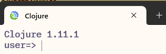

# Why Clojure

Clojure addresses the following pain points with existing languages -

1. **Wrong defaults** - existing OO languages are built with wrong defaults e.g. reference equality, mutable collections etc.
2. **No interactive mode** (REPL) - so no easy way to experiment various language / library features

## Salient features

1. Clojure is a dialect of Lisp (which stands for **Lis**t **P**rocessing). [Racket](https://racket-lang.org/) & [Common Lisp](https://lisp-lang.org/) are some other languages from the Lisp family.
2. Runs on **JVM** (or compiles to JVM) supporting existing investments made by customers in Java frameworks and libraries. It also has a port that compiles to JavaScript, called [ClojureScript](https://clojurescript.org/). Then, there is [ClojureDart](https://github.com/Tensegritics/ClojureDart) for Flutter and Dart. Yet another is [libpython-clj](https://github.com/clj-python/libpython-clj) for interacting with Python.
3. It has a **REPL** (which stands for **R**ead **E**val **P**rint **L**oop) - which is the interactive mode, just like other dynamic languages have e.g. Python or the modern FP languages have, like [Scala](https://www.scala-lang.org/) & [F#](https://fsharp.org/).
4. It has **value equality** (also called structural equality) - meaning, it compares for values (of arrays, maps etc. not their references).
5. It has **immutable collections** - which means, once you've initialized an array or a map, it's value cannot be changed. Any change e.g. adding, removing or modifying existing elements leads to new versions of existing collections.
6. It is an **FP language** - meaning, you don't need to write classes, just write functions. You can pass a function to other functions, you can return a function from another function and you can store a function in a variable etc.
7. FP languages are **expression oriented** i.e. various constructs return a value e.g. if-else is an expression, for loop is an expression (whereas in OO languages like Java or C#, if-else is a statement).

## Installation

You can install Clojure using the instructions on [Install Clojure](https://clojure.org/guides/install_clojure) page. Additional instructions on installing it on Windows are [here](https://github.com/clojure/tools.deps.alpha/wiki/clj-on-Windows). Once it is installed and you run the `clj` command, your command prompt should look like this - 

## REPL

